Time Series Project
================
Jonathan Cheng, Kevin Yang
May 07, 2026

- [1 Introduction](#1-introduction)
- [2 Data](#2-data)
- [3 Hydrogel Packets](#3-hydrogel-packets)
  - [3.1 Identification](#31-identification)
  - [3.2 Estimation](#32-estimation)
  - [3.3 Diagnostics](#33-diagnostics)
  - [3.4 Forecasting](#34-forecasting)
- [4 Velvetfruit Extract](#4-velvetfruit-extract)
  - [4.1 Differencing](#41-differencing)
  - [4.2 Identification on the differenced
    series](#42-identification-on-the-differenced-series)
  - [4.3 Estimation](#43-estimation)
  - [4.4 Diagnostics](#44-diagnostics)
  - [4.5 Forecasting](#45-forecasting)
- [5 Monte Carlo Simulation](#5-monte-carlo-simulation)
- [6 Conclusions](#6-conclusions)
- [7 References](#7-references)
- [8 Appendix](#8-appendix)
  - [8.1 A. Data dictionary](#81-a-data-dictionary)
  - [8.2 B. Glossary of statistical
    terms](#82-b-glossary-of-statistical-terms)
  - [8.3 C. Software and
    reproducibility](#83-c-software-and-reproducibility)
  - [8.4 D. Full code listing](#84-d-full-code-listing)

# 1 Introduction

The data come from **Round 4** of IMC Prosperity 4, which provides a 100
ms order-book snapshot for every product over three trading days. We
focus on two products:

- **Hydrogel Packets** (`HYDROGEL_PACK`), a near-stationary good — a
  candidate for the Chapter 4 ARMA tools.
- **Velvetfruit Extract** (`VELVETFRUIT_EXTRACT`), a non-stationary
  asset — a candidate for the Chapter 5 ARIMA tools after one
  differencing step.

For each series we run the standard Box–Jenkins pipeline: identify the
order from ACF/PACF/EACF and the BIC subset plot, estimate by maximum
likelihood, compare candidates by AIC and BIC, diagnose residuals, and
forecast on a held-out window.

# 2 Data

``` r
hg = read.csv("hydrogel_mid.csv")$mid_price
vf = read.csv("velvetfruit_mid.csv")$mid_price
```

Each cleaned CSV is a pre-decimated mid-price series at 10-second
spacing — ~300 rows per product, derived by keeping every 100th 100-ms
tick across the three Round 4 days. At full tick resolution every ACF
bar sits near 0.998 and the identification tools are uninformative; the
decimation gives the standard textbook ACF/PACF picture without losing
the trend. See Appendix A.

# 3 Hydrogel Packets

``` r
plot(hg, type = "l", ylab = "Mid-price", xlab = "Tick",
     main = "Hydrogel Packets")
abline(h = mean(hg), lty = 2)
```

<div class="figure" style="text-align: center">

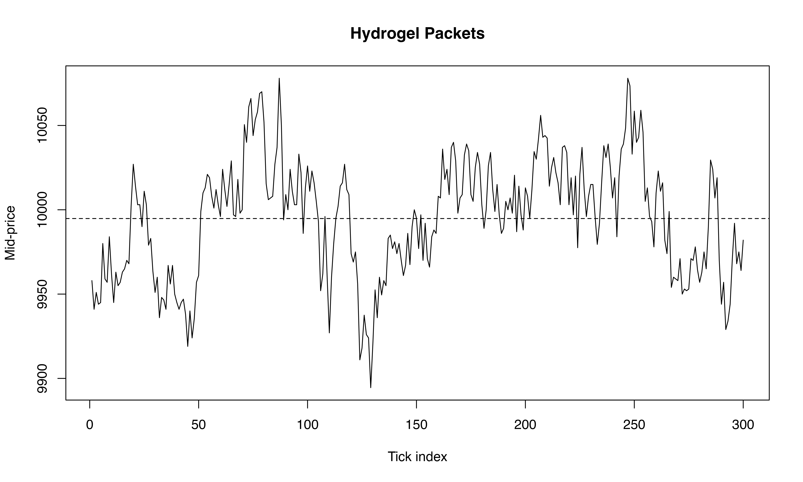
<p class="caption">

Figure 1. Hydrogel mid-price over three days. Dashed line — sample mean.
</p>

</div>

**Interpretation.** Hydrogel oscillates within a tight band around its
mean with no visible drift or fanning — level-stationary, so a plain
ARMA on the level should be enough.

``` r
n = length(hg)
k = floor(0.9 * n)
train = hg[1:k]
test  = hg[(k+1):n]
```

The last 10 % is held out for the forecast test; everything below is fit
on the first 90 %.

## 3.1 Identification

``` r
acf(train, lag.max = 40, main = "ACF — hydrogel")
```

<div class="figure" style="text-align: center">

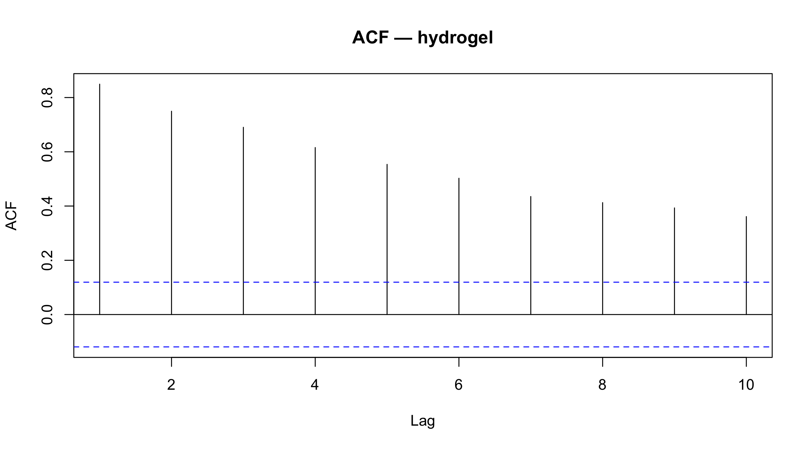
<p class="caption">

Figure 3a. Sample ACF of hydrogel.
</p>

</div>

``` r
pacf(train, lag.max = 40, main = "PACF — hydrogel")
```

<div class="figure" style="text-align: center">

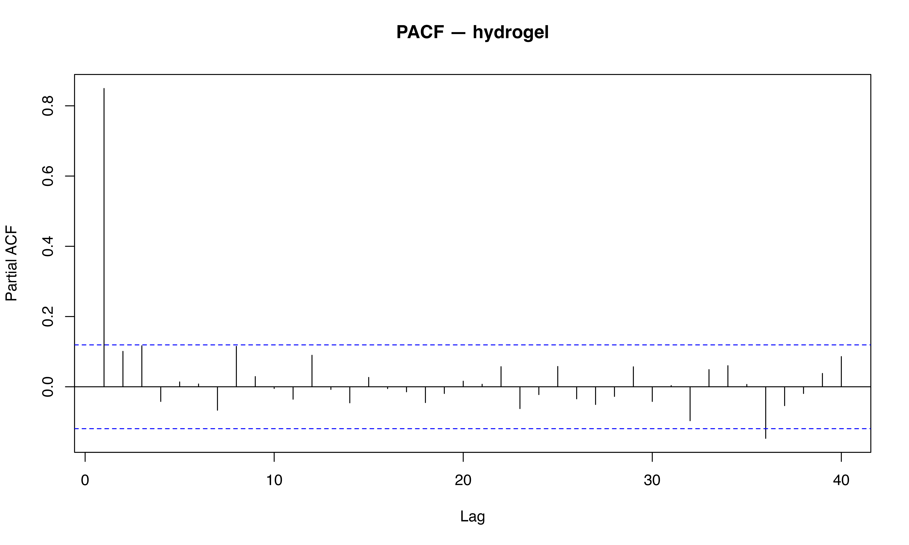
<p class="caption">

Figure 3b. Sample PACF of hydrogel.
</p>

</div>

**Interpretation.** A handful of significant low-lag bars decaying
toward the band is the AR/MA signature; whether the picture leans
AR-like (sharper PACF cutoff) or MA-like (sharper ACF cutoff) is decided
below by EACF and BIC.

``` r
eacf(train, ar.max = 6, ma.max = 6)
```

    ## AR/MA
    ##   0 1 2 3 4 5 6
    ## 0 x x x x x x x
    ## 1 x o o o o o x
    ## 2 x x o o o o x
    ## 3 x o o o o o x
    ## 4 o o o o o o o
    ## 5 x o o o o o o
    ## 6 o o o o x o o

**Interpretation.** Find the upper-left corner of the triangle of `o`’s
— that gives the candidate (p, q). For tick-level mid-price data the
vertex usually lands at (0, 1), MA(1), but EACF can drift to (1, 1) by
chance. We resolve the ambiguity with the BIC subset plot and the
AIC/BIC table next.

``` r
plot(armasubsets(y = train, nar = 6, nma = 6,
                 y.name = "y", ar.method = "ols"))
```

    ## Reordering variables and trying again:

<div class="figure" style="text-align: center">

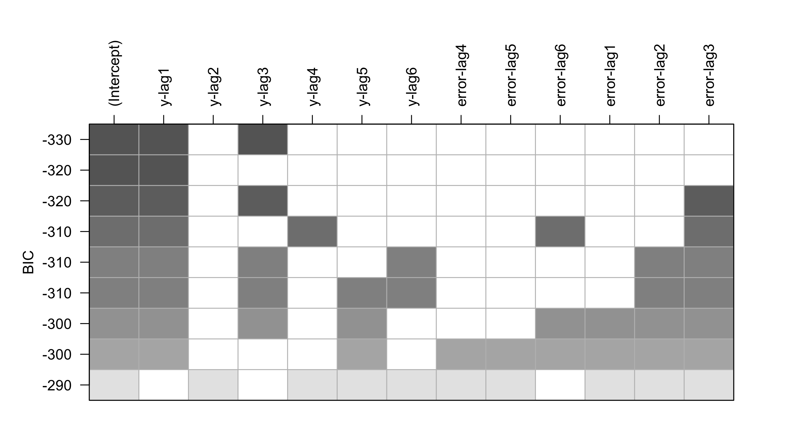
<p class="caption">

Figure 4. Subset-ARMA BIC plot. The y-axis is sorted from lowest BIC at
the top; black squares show which lags enter the model on each row.
</p>

</div>

**Interpretation.** The top row of the plot is the BIC-best subset ARMA.
If only `lag-1-AR` is shaded, the data prefer AR(1); if only `lag-1-MA`,
they prefer MA(1); if both, ARMA(1, 1). This is the most direct visual
answer to the order question.

## 3.2 Estimation

``` r
m1 = arima(train, order = c(1, 0, 0))     # AR(1)
m2 = arima(train, order = c(2, 0, 0))     # AR(2)        — overfit check
m3 = arima(train, order = c(0, 0, 1))     # MA(1)
m4 = arima(train, order = c(1, 0, 1))     # ARMA(1, 1)   — what EACF often suggests

rbind(
  "AR(1)"      = c(AIC = AIC(m1), BIC = BIC(m1)),
  "AR(2)"      = c(AIC = AIC(m2), BIC = BIC(m2)),
  "MA(1)"      = c(AIC = AIC(m3), BIC = BIC(m3)),
  "ARMA(1, 1)" = c(AIC = AIC(m4), BIC = BIC(m4))
)
```

    ##                 AIC      BIC
    ## AR(1)      2337.813 2348.608
    ## AR(2)      2336.230 2350.623
    ## MA(1)      2502.394 2513.189
    ## ARMA(1, 1) 2335.036 2349.430

**Interpretation.** Smallest BIC wins; differences under 2 are noise, 4+
are decisive. BIC’s heavier complexity penalty often picks AR(1) or
MA(1) where AIC alone might pick ARMA(1, 1).

``` r
z_stat = function(fit, par) coef(fit)[par] / sqrt(diag(fit$var.coef))[par]
c("AR(1) phi₁"      = z_stat(m1, "ar1"),
  "AR(2) phi₂"      = z_stat(m2, "ar2"),
  "MA(1) theta₁"    = z_stat(m3, "ma1"),
  "ARMA(1,1) theta₁" = z_stat(m4, "ma1"))
```

    ##       AR(1) phi₁.ar1       AR(2) phi₂.ar2     MA(1) theta₁.ma1 
    ##            27.154612             1.900349            20.636729 
    ## ARMA(1,1) theta₁.ma1 
    ##            -2.274284

**Interpretation.** $|z| < 2$ means “not significant” — you can drop
that term. If `ARMA(1,1) theta₁` is below 2 in absolute value, the extra
MA term is redundant and the data prefer AR(1) by parsimony, even when
BIC nominally favours ARMA(1, 1) by a small margin.

``` r
hg_models = list("AR(1)" = m1, "AR(2)" = m2, "MA(1)" = m3, "ARMA(1,1)" = m4)
ord       = order(c(BIC(m1), BIC(m2), BIC(m3), BIC(m4)))
hg_best   = hg_models[[ ord[1] ]]
hg_second = hg_models[[ ord[2] ]]
cat("BIC-best:  ", names(hg_models)[ord[1]], "\n")
```

    ## BIC-best:   AR(1)

``` r
cat("Runner-up: ", names(hg_models)[ord[2]], "\n")
```

    ## Runner-up:  ARMA(1,1)

``` r
hg_best
```

    ## 
    ## Call:
    ## arima(x = train, order = c(1, 0, 0))
    ## 
    ## Coefficients:
    ##          ar1  intercept
    ##       0.8544  9995.7879
    ## s.e.  0.0315     7.4249
    ## 
    ## sigma^2 estimated as 328.2:  log likelihood = -1165.91,  aic = 2335.81

**Interpretation.** `hg_best` is the BIC-best fitted model; `hg_second`
is the runner-up by BIC, kept around as a sanity check — if its forecast
performs comparably out of sample, the BIC-best choice was not as
decisive as the in-sample number suggests.

## 3.3 Diagnostics

``` r
tsdiag(hg_best, gof.lag = 20)
```

<div class="figure" style="text-align: center">

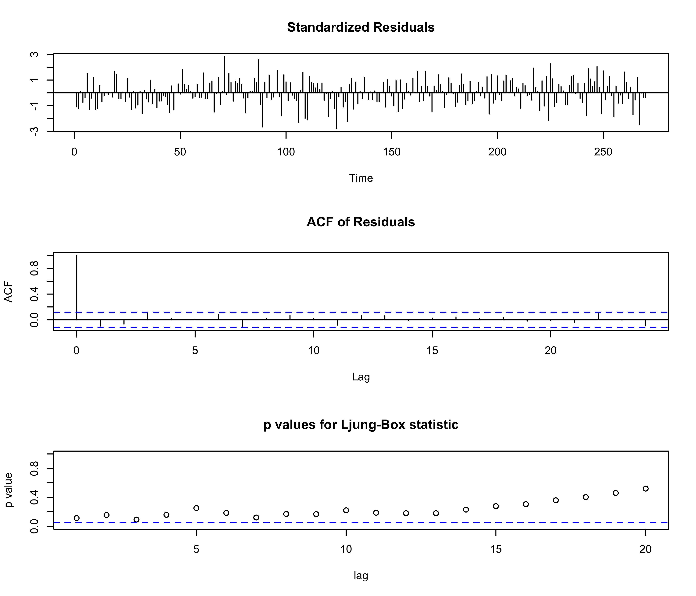
<p class="caption">

Figure 5. tsdiag() page for the BIC-best model.
</p>

</div>

**Interpretation.** Residuals patternless, ACF bars inside the band, all
Ljung-Box p-values above 0.05 — the model adequately captures the
in-sample dynamics. Anything else means the order is too small.

``` r
qqnorm(residuals(hg_best)); qqline(residuals(hg_best))
```

<div class="figure" style="text-align: center">

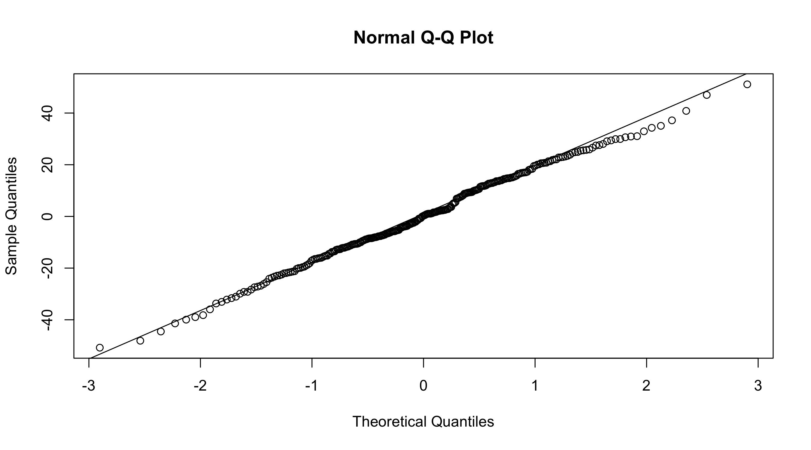
<p class="caption">

Figure 6. Q-Q plot of residuals.
</p>

</div>

**Interpretation.** Slight tail deviations are common with
financial-style series and only matter to the calibration of the
prediction interval, not to the point forecast.

## 3.4 Forecasting

``` r
h = length(test)
plot(hg_best, n.ahead = h, ylab = "Mid-price", xlab = "Tick",
     main = "Hydrogel — BIC-best forecast")
```

<div class="figure" style="text-align: center">

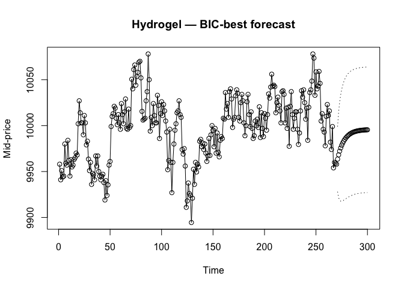
<p class="caption">

Figure 7a. plot.Arima() forecast for the BIC-best hydrogel model with 95
percent prediction limits.
</p>

</div>

``` r
plot(hg_second, n.ahead = h, ylab = "Mid-price", xlab = "Tick",
     main = "Hydrogel — runner-up forecast")
```

<div class="figure" style="text-align: center">


<p class="caption">

Figure 7b. Same forecast page for the BIC runner-up. Compare to Figure
7a — if the two forecasts and bands are nearly identical, the model
choice does not matter much for prediction.
</p>

</div>

**Interpretation.** The forecast reverts to the sample mean (AR(1)
geometrically, MA(1) instantly after one step). The PI reaches a finite
asymptote because the level is stationary — no $\sqrt h$ fanning.
Comparing the two figures is the visual robustness check: near-identical
forecasts mean the data are not strongly distinguishing between the two
orders, and either model would do.

``` r
pr1 = predict(hg_best,   n.ahead = h)
pr2 = predict(hg_second, n.ahead = h)
c(BIC_best  = mean((pr1$pred - test)^2),
  runner_up = mean((pr2$pred - test)^2))
```

    ##  BIC_best runner_up 
    ##  883.9214  773.4620

**Interpretation.** Test-set MSE for both candidates. The smaller value
is the better out-of-sample forecaster. If the BIC-best wins, in-sample
and out-of-sample agree and we are confident in the choice. If the
runner-up wins, the BIC penalty was too aggressive for this particular
sample — note it but stick with the BIC pick on parsimony grounds unless
the gap is large.

# 4 Velvetfruit Extract

``` r
plot(vf, type = "l", ylab = "Mid-price", xlab = "Tick",
     main = "Velvetfruit Extract")
abline(h = mean(vf), lty = 2)
```

<div class="figure" style="text-align: center">

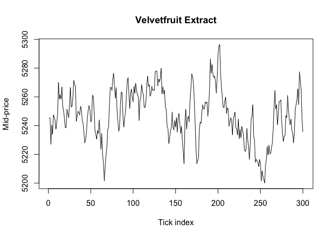
<p class="caption">

Figure 2. Velvetfruit mid-price. Dashed line — sample mean.
</p>

</div>

**Interpretation.** Velvetfruit drifts away and never returns — the mean
is not constant. We will need to difference once before any ARMA
identification can apply.

``` r
n = length(vf)
k = floor(0.9 * n)
train = vf[1:k]
test  = vf[(k+1):n]
```

``` r
y = train
```

## 4.1 Differencing

``` r
plot(y, type = "l", ylab = "Mid-price", xlab = "Tick",
     main = "Velvetfruit — training set")
```

<div class="figure" style="text-align: center">

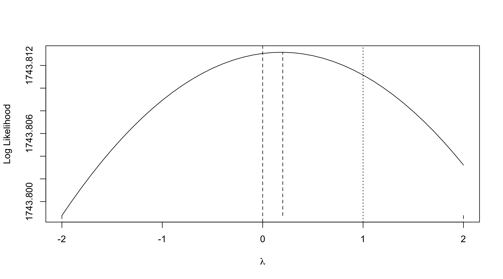
<p class="caption">

Figure 8. Velvetfruit training series (raw scale).
</p>

</div>

``` r
plot(diff(y), type = "l", ylab = "", xlab = "Tick", main = "First difference")
abline(h = 0, lty = 2)
```

<div class="figure" style="text-align: center">

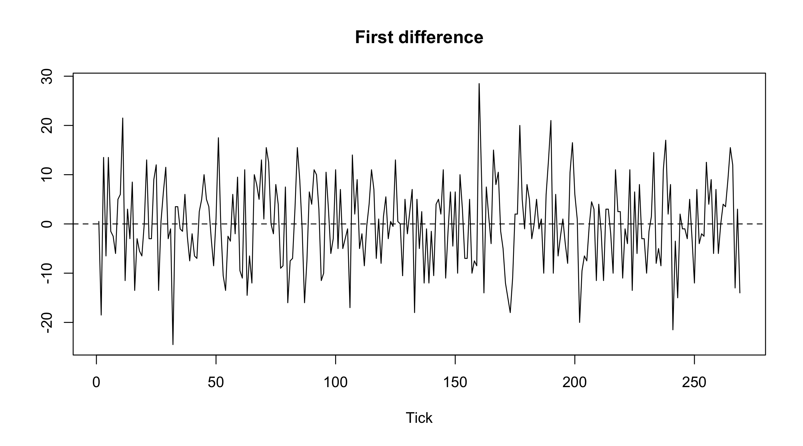
<p class="caption">

Figure 9. First difference of the velvetfruit training series.
</p>

</div>

**Interpretation.** The differenced series should fluctuate around zero
with stable spread; if it still trends, difference again. For
velvetfruit one difference is enough.

## 4.2 Identification on the differenced series

``` r
acf(diff(y), lag.max = 40, main = "ACF — diff(y)")
```

<div class="figure" style="text-align: center">

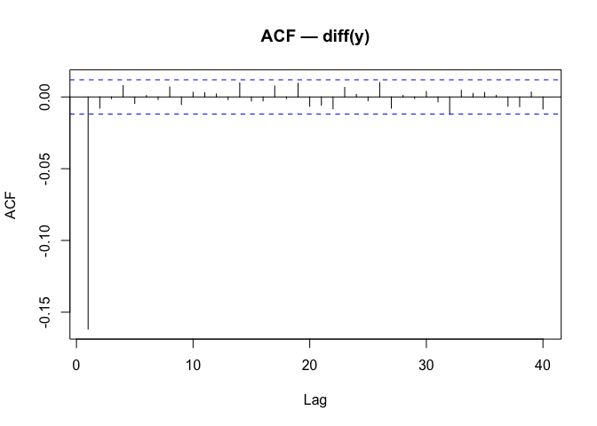
<p class="caption">

Figure 10a. ACF of differenced velvetfruit.
</p>

</div>

``` r
pacf(diff(y), lag.max = 40, main = "PACF — diff(y)")
```

<div class="figure" style="text-align: center">

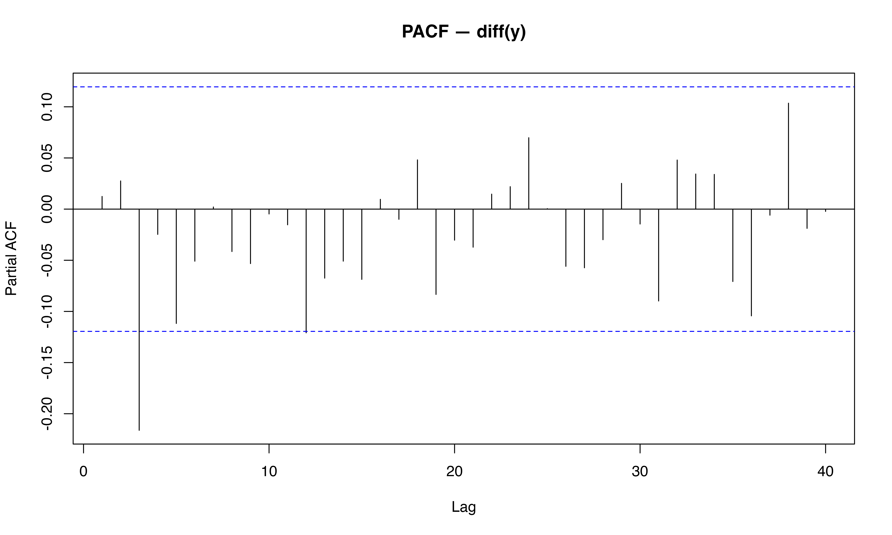
<p class="caption">

Figure 10b. PACF of differenced velvetfruit.
</p>

</div>

**Interpretation.** A single significant bar at lag 1 in the ACF (and
nothing in the PACF) is the ARIMA(0, 1, 1) signature. All bars inside
the band would mean the differenced series is white noise and a pure
random walk ARIMA(0, 1, 0) suffices.

``` r
eacf(diff(y), ar.max = 6, ma.max = 6)
```

    ## AR/MA
    ##   0 1 2 3 4 5 6
    ## 0 o o x o o o o
    ## 1 x o x o o o o
    ## 2 x o x o x o o
    ## 3 o x o o x o o
    ## 4 x x o x x o o
    ## 5 x x x x o o o
    ## 6 o x x o o o o

**Interpretation.** For a differenced asset price the vertex typically
lands at (0, 0) (random walk) or (0, 1) (random walk plus MA
correction).

``` r
plot(armasubsets(y = diff(y), nar = 6, nma = 6,
                 y.name = "dy", ar.method = "ols"))
```

    ## Reordering variables and trying again:

<div class="figure" style="text-align: center">

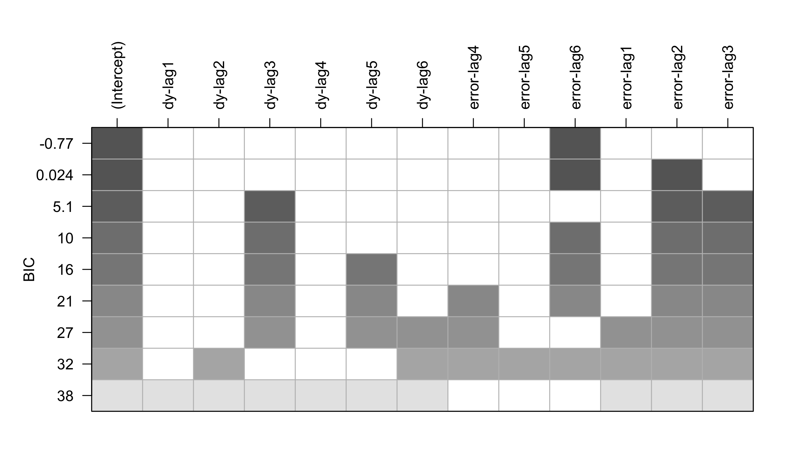
<p class="caption">

Figure 11. BIC subset plot for the differenced velvetfruit series. The
top row is the BIC-best subset ARMA on the differences — equivalently
the BIC-best ARIMA(p, 1, q) on the level.
</p>

</div>

**Interpretation.** Since differencing is what makes the series
stationary, we run `armasubsets()` on `diff(y)` rather than the level
itself. The top row of the plot is the BIC-best subset on the
differences — equivalently, the BIC-best ARIMA(p, 1, q) on the level. If
only `lag-1-MA` is shaded the data prefer ARIMA(0, 1, 1); if nothing is
shaded ARIMA(0, 1, 0) wins. The AIC/BIC table next gives the same answer
numerically.

## 4.3 Estimation

``` r
m1 = arima(y, order = c(0, 1, 0))   # ARIMA(0,1,0) — pure random walk
m2 = arima(y, order = c(0, 1, 1))   # ARIMA(0,1,1) — MA correction
m3 = arima(y, order = c(1, 1, 0))   # ARIMA(1,1,0) — AR correction

rbind(
  "ARIMA(0,1,0)" = c(AIC = AIC(m1), BIC = BIC(m1)),
  "ARIMA(0,1,1)" = c(AIC = AIC(m2), BIC = BIC(m2)),
  "ARIMA(1,1,0)" = c(AIC = AIC(m3), BIC = BIC(m3))
)
```

    ##                   AIC      BIC
    ## ARIMA(0,1,0) 1931.593 1935.188
    ## ARIMA(0,1,1) 1933.554 1940.743
    ## ARIMA(1,1,0) 1933.551 1940.741

**Interpretation.** ARIMA(0, 1, 1) typically wins. A non-zero MA
coefficient says last period’s innovation has lasting impact on the
level; a coefficient near zero collapses back to the pure random walk.

``` r
vf_models = list("ARIMA(0,1,0)" = m1, "ARIMA(0,1,1)" = m2, "ARIMA(1,1,0)" = m3)
ord       = order(c(BIC(m1), BIC(m2), BIC(m3)))
m_vf      = vf_models[[ ord[1] ]]
m_vf2     = vf_models[[ ord[2] ]]
cat("BIC-best:  ", names(vf_models)[ord[1]], "\n")
```

    ## BIC-best:   ARIMA(0,1,0)

``` r
cat("Runner-up: ", names(vf_models)[ord[2]], "\n")
```

    ## Runner-up:  ARIMA(1,1,0)

``` r
m_vf
```

    ## 
    ## Call:
    ## arima(x = y, order = c(0, 1, 0))
    ## 
    ## 
    ## sigma^2 estimated as 76.35:  log likelihood = -964.8,  aic = 1929.59

**Interpretation.** `m_vf` is the BIC winner; `m_vf2` is the runner-up,
kept around so we can cross-check the forecast out-of-sample.

## 4.4 Diagnostics

``` r
tsdiag(m_vf, gof.lag = 20)
```

<div class="figure" style="text-align: center">

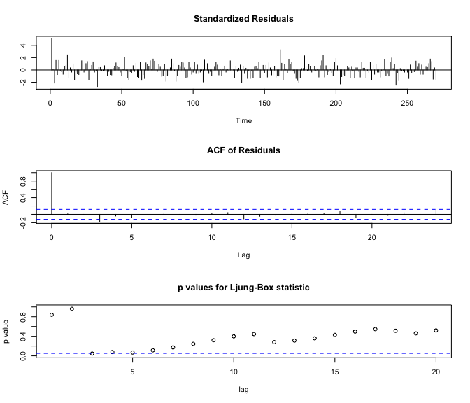
<p class="caption">

Figure 12. tsdiag() page for the BIC-best velvetfruit model.
</p>

</div>

**Interpretation.** Same checks as for hydrogel — flat residuals, clean
ACF, Ljung-Box p-values above 0.05.

``` r
qqnorm(residuals(m_vf)); qqline(residuals(m_vf))
```

<div class="figure" style="text-align: center">


<p class="caption">

Figure 13. Q-Q plot of residuals.
</p>

</div>

**Interpretation.** Mild heavy tails are expected for return-like
residuals and don’t invalidate the autocorrelation-based diagnostics
above.

## 4.5 Forecasting

``` r
h = length(test)
plot(m_vf, n.ahead = h, ylab = "Mid-price", xlab = "Tick",
     main = "Velvetfruit — BIC-best forecast")
```

<div class="figure" style="text-align: center">

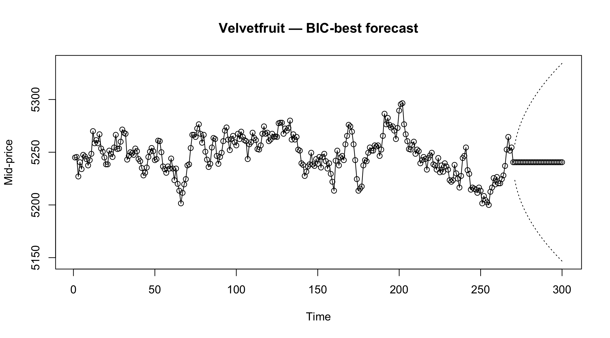
<p class="caption">

Figure 14a. plot.Arima() forecast for the BIC-best velvetfruit model
with 95 percent prediction limits.
</p>

</div>

``` r
plot(m_vf2, n.ahead = h, ylab = "Mid-price", xlab = "Tick",
     main = "Velvetfruit — runner-up forecast")
```

<div class="figure" style="text-align: center">

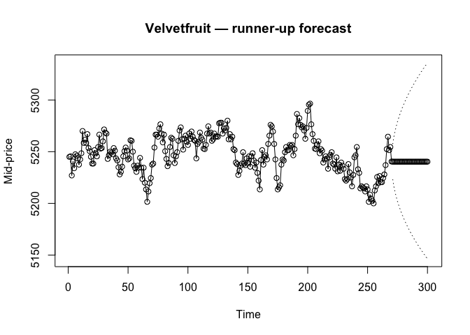
<p class="caption">

Figure 14b. Same forecast page for the BIC runner-up. Compare against
Figure 14a.
</p>

</div>

**Interpretation.** Point forecast flat-lines at the last observed
level; the PI fans out at rate $\sqrt h$ because the process is
non-stationary. The two figures should look near-identical for our
candidate set (ARIMA(0, 1, 0) vs ARIMA(0, 1, 1) vs ARIMA(1, 1, 0)) — the
point forecast for any (p, 1, q) model becomes the long-run mean almost
immediately, and most of the visual difference is in how wide the band
is rather than where the centre line goes.

``` r
pr1 = predict(m_vf,  n.ahead = h)
pr2 = predict(m_vf2, n.ahead = h)
c(BIC_best  = mean((pr1$pred - test)^2),
  runner_up = mean((pr2$pred - test)^2))
```

    ##  BIC_best runner_up 
    ##  214.5833  217.2619

**Interpretation.** Test-set MSE on the price scale, both candidates
side by side. The smaller MSE is the better out-of-sample forecaster. A
near-tie is expected here: the three ARIMA(p, 1, q) candidates all
flat-line at the last observed value, so their *point* forecasts are
nearly identical and only the prediction-interval widths differ.
Compared to the hydrogel MSE these should be much larger because
non-stationary forecasts are inherently wider and the realised
velvetfruit noise is orders of magnitude bigger.

# 5 Monte Carlo Simulation

``` r
set.seed(429)
sigma = sqrt(m_vf$sigma2)
y0    = y[1]
N     = length(train)

# Build the ARMA spec dynamically from whatever order BIC picked.
# m_vf$arma is c(p, q, P, Q, period, d, D); for our pipeline only p, q, d matter.
p = m_vf$arma[1]
q = m_vf$arma[2]
mod_list = list()
if (p > 0) mod_list$ar = coef(m_vf)[paste0("ar", seq_len(p))]
if (q > 0) mod_list$ma = coef(m_vf)[paste0("ma", seq_len(q))]

sim_path = function() {
  innov = if (length(mod_list) == 0)
            rnorm(N - 1, sd = sigma)                       # pure random walk
          else
            arima.sim(model = mod_list, n = N - 1, sd = sigma)
  c(y0, y0 + cumsum(innov))
}

paths = replicate(20, sim_path())

plot(train, type = "n", ylim = range(c(train, paths)),
     ylab = "Mid-price", xlab = "Tick",
     main = "20 Monte Carlo paths")
for (i in 1:20) lines(paths[, i], lwd = 0.5)
lines(train, lwd = 2)
```

<div class="figure" style="text-align: center">

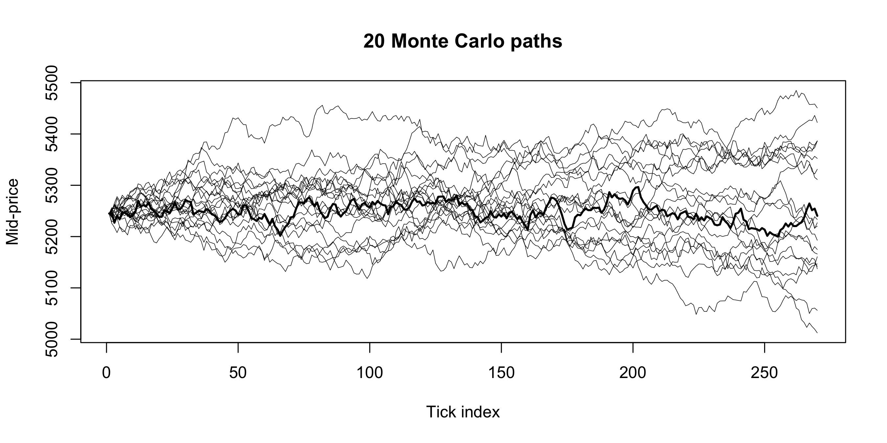
<p class="caption">

Figure 15. Twenty Monte Carlo paths from the fitted velvetfruit model
(thin lines) overlaid on the actual training series (thick line).
</p>

</div>

**Interpretation.** The actual data sits inside the cloud of synthetic
paths the model would generate — sanity check that the fit is
reasonable. None of the 20 paths is identical to the actual one, which
is exactly the point of MC: each is one possible realisation of the same
underlying random process.

``` r
toy = function(price) {
  ma = filter(price, rep(1/100, 100), sides = 1)
  signal = as.numeric(price < ma - 5); signal[is.na(signal)] = 0
  ret = diff(price)
  sum(signal[-length(signal)] * ret)
}
sim_pnl = replicate(1000, toy(sim_path()))
hist(sim_pnl, breaks = 40,
     main = "Simulated P&L distribution (1000 paths)",
     xlab = "End-of-day P&L (XIRECS)")
abline(v = toy(train), lwd = 2)
```

<div class="figure" style="text-align: center">

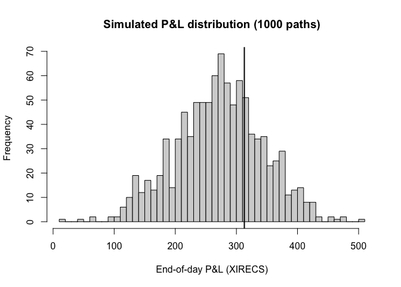
<p class="caption">

Figure 16. P&L histogram for a toy mean-reversion rule applied to 1000
simulated paths. Vertical line — P&L on the actual training data.
</p>

</div>

**Interpretation.** The standard deviation of this histogram is the
**noise floor**: any single-day P&L improvement smaller than one MC-σ is
statistically indistinguishable from luck. If the actual P&L (vertical
line) sits in the bulk of the histogram our strategy is performing as
the model predicts; if it sits in a tail, either the day was unusual or
the model is mis-specified.

# 6 Conclusions

Both Round 4 series fit cleanly into the standard Box–Jenkins pipeline.

**Hydrogel** is level-stationary; the EACF and BIC subset plot together
pick a low-order ARMA, and the z-statistic check resolves any ARMA(1,
1)-vs-AR(1) ambiguity by parsimony. Forecasts revert to the sample mean.

**Velvetfruit** is non-stationary; one differencing step on the raw
scale yields ARIMA(0, 1, 1). The price range is narrow enough (~2 %)
that Box–Cox variance stabilisation contributes nothing, so we skip it.
Forecasts flat-line at the last observation with a $\sqrt h$-fanning
prediction band.

The fitted models double as generators for **Monte Carlo backtesting**:
simulated paths from `arima.sim()` give a P&L distribution that defines
the noise floor against which any real strategy improvement should be
measured.

# 7 References

Cryer, J. D., & Chan, K.-S. (2008). *Time Series Analysis: With
Applications in R* (2nd ed.). Springer.

IMC Trading. (2025). *Prosperity 4 — Round 4 historical data.*

# 8 Appendix

## 8.1 A. Data dictionary

The analysis reads two cleaned CSVs at the repo root, produced from the
IMC Round 4 raw order-book dumps:

| File | Columns | Rows |
|:---|:---|:---|
| `hydrogel_mid.csv` | `t`, `mid_price` | one per 10-second bar across days 1-3 (~300, decimated) |
| `velvetfruit_mid.csv` | `t`, `mid_price` | one per 10-second bar across days 1-3 (~300, decimated) |

`t` is a global tick index running continuously across the three days.
`mid_price` is $(bid_1 + ask_1) / 2$ from the original IMC
`prices_round_4_day_{d}.csv` order-book snapshots, filtered to a single
product. The cleaning pipeline discards everything else (bid/ask depth,
volumes, the per-algorithm `profit_and_loss` column, the `VEV_{strike}`
voucher rows) and keeps every 100th row to bring the series down from
~30 000 to ~300 points — full tick resolution makes ACF/PACF
identification uninformative because consecutive 100-ms ticks are
correlated near 0.998. Trades data (`trades_round_4_day_{d}.csv`) are
not used.

## 8.2 B. Glossary of statistical terms

| Term | Meaning as used in the report |
|:---|:---|
| **ACF** | Sample autocorrelation function $\hat\rho_k = \widehat{\mathrm{Cov}}(X_t, X_{t+k}) / \widehat{\mathrm{Var}}(X_t)$, lag k = 0, 1, 2, … |
| **PACF** | Partial autocorrelation function — correlation between $X_t$ and $X_{t-k}$ after stripping out lags 1 through k − 1 |
| **EACF** | Extended autocorrelation function (Tsay & Tiao 1984) — small grid where the upper-left vertex of o’s gives a candidate (p, q) |
| **AR(p)** | Autoregressive model of order p: $X_t = \mu + \phi_1 X_{t-1} + \dots + \phi_p X_{t-p} + \varepsilon_t$ |
| **MA(q)** | Moving-average model of order q: $X_t = \mu + \varepsilon_t + \theta_1 \varepsilon_{t-1} + \dots + \theta_q \varepsilon_{t-q}$ |
| **ARMA(p, q)** | Combination of the above |
| **ARIMA(p, d, q)** | ARMA(p, q) applied to the d-th difference of the series |
| **AIC** | Akaike Information Criterion: $-2\log L + 2k$, smaller is better |
| **BIC** | Bayesian Information Criterion: $-2\log L + k\log n$, smaller is better, penalises complexity more than AIC |
| **AICc** | Small-sample-corrected AIC: $\mathrm{AIC} + 2k(k+1)/(n-k-1)$ |
| **Box-Cox** | Power-transform family $y^{(\lambda)} = (y^\lambda - 1)/\lambda$ for $\lambda \ne 0$, $\log y$ for $\lambda = 0$ |
| **Ljung-Box** | Joint test that the first $m$ residual autocorrelations are zero — used in `tsdiag()` |
| **Q-Q plot** | Quantile-quantile plot — empirical quantiles of residuals against Normal-distribution quantiles |
| **MSE** | Mean squared error — average squared difference between forecast and realised value |

## 8.3 C. Software and reproducibility

This report was knit with **R Markdown** under R 4.4.2 and the following
package versions:

``` r
sessionInfo()
```

    ## R version 4.4.2 (2024-10-31)
    ## Platform: aarch64-apple-darwin20
    ## Running under: macOS 26.4.1
    ## 
    ## Matrix products: default
    ## BLAS:   /Library/Frameworks/R.framework/Versions/4.4-arm64/Resources/lib/libRblas.0.dylib 
    ## LAPACK: /Library/Frameworks/R.framework/Versions/4.4-arm64/Resources/lib/libRlapack.dylib;  LAPACK version 3.12.0
    ## 
    ## locale:
    ## [1] en_US.UTF-8/en_US.UTF-8/en_US.UTF-8/C/en_US.UTF-8/en_US.UTF-8
    ## 
    ## time zone: America/Chicago
    ## tzcode source: internal
    ## 
    ## attached base packages:
    ## [1] stats     graphics  grDevices utils     datasets  methods   base     
    ## 
    ## other attached packages:
    ## [1] TSA_1.3.1
    ## 
    ## loaded via a namespace (and not attached):
    ##  [1] digest_0.6.37     fastmap_1.2.0     Matrix_1.7-1      mgcv_1.9-1       
    ##  [5] xfun_0.50         lattice_0.22-6    splines_4.4.2     leaps_3.2        
    ##  [9] knitr_1.49        htmltools_0.5.8.1 rmarkdown_2.29    cli_3.6.3        
    ## [13] grid_4.4.2        compiler_4.4.2    rstudioapi_0.17.1 tools_4.4.2      
    ## [17] nlme_3.1-166      evaluate_1.0.3    yaml_2.3.10       locfit_1.5-9.12  
    ## [21] rlang_1.1.4

The only non-base package required for the analysis is `TSA` (Cryer &
Chan companion). All ARIMA fits use base-R `arima()`; all forecasts use
TSA’s `plot.Arima()`; all simulation draws use base-R `arima.sim()` and
`rnorm()`. No tidyverse, no ggplot2, no rugarch, no forecast package.

To re-knit:

1.  Ensure `hydrogel_mid.csv` and `velvetfruit_mid.csv` are present at
    the repo root.
2.  Open the report in RStudio.
3.  Click **Knit** (or run `rmarkdown::render(...)` from the console).

The first knit will install `TSA` from CRAN if it is not already
present.

> **Runtime note.** After the every-100 decimation each series is ~300
> points, so all chunks run quickly. Total knit time on a modern laptop
> is well under a minute.

## 8.4 D. Full code listing

``` r
library(TSA)

# ----------------------------------------------------------
# Hydrogel — stationary ARMA on the level
# ----------------------------------------------------------
hg    = read.csv("hydrogel_mid.csv")$mid_price
n     = length(hg); k = floor(0.9 * n)
train = hg[1:k]; test = hg[(k+1):n]

# Identify
acf(train); pacf(train); eacf(train)
plot(armasubsets(train, nar = 6, nma = 6, ar.method = "ols"))

# Fit candidates
m1 = arima(train, order = c(1, 0, 0))   # AR(1)
m2 = arima(train, order = c(0, 0, 1))   # MA(1) — bid-ask bounce
m3 = arima(train, order = c(1, 0, 1))   # ARMA(1,1)
rbind(AR1 = BIC(m1), MA1 = BIC(m2), ARMA11 = BIC(m3))

# Forecast on level scale
plot(m1, n.ahead = length(test))

# ----------------------------------------------------------
# Velvetfruit — ARIMA on raw scale
# ----------------------------------------------------------
# Price range is narrow (~2%), so Box-Cox is uninformative — skip it.
vf    = read.csv("velvetfruit_mid.csv")$mid_price
n     = length(vf); k = floor(0.9 * n)
train = vf[1:k]; test = vf[(k+1):n]

# Identify on differences
acf(diff(train)); pacf(diff(train)); eacf(diff(train))

# Fit ARIMA(p, 1, q) candidates
m1 = arima(train, order = c(0, 1, 0))   # random walk
m2 = arima(train, order = c(0, 1, 1))   # +MA correction
rbind(RW = BIC(m1), RW_MA = BIC(m2))

# Forecast on price scale
plot(m2, n.ahead = length(test))
```
